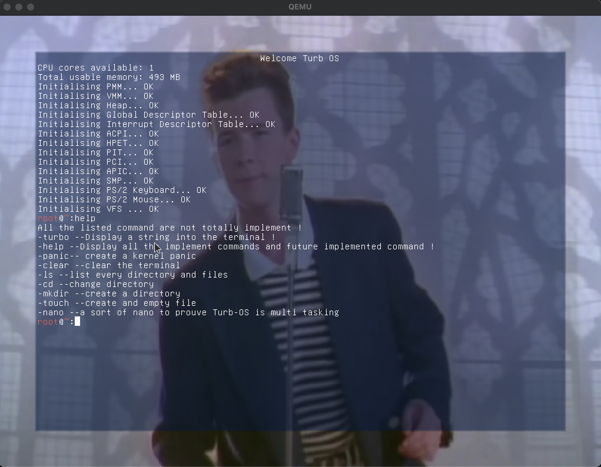
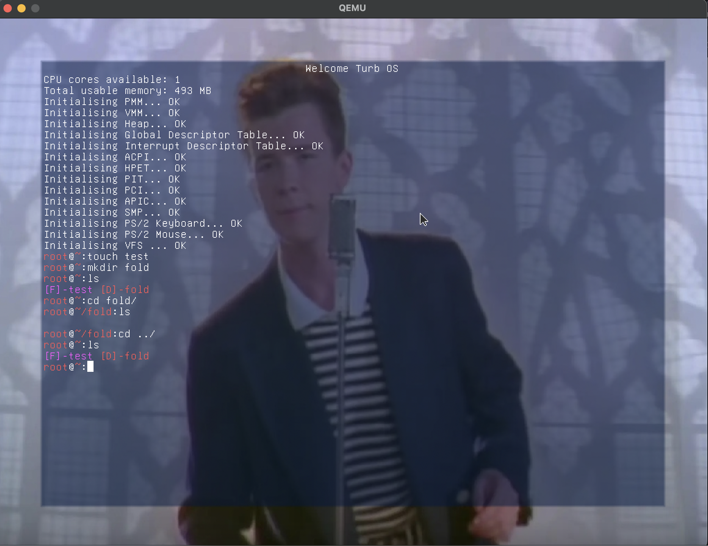
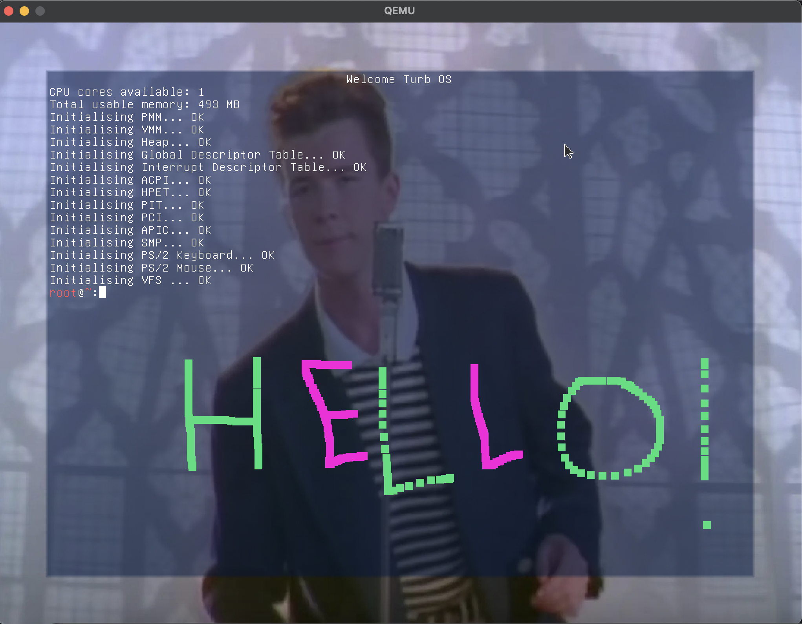
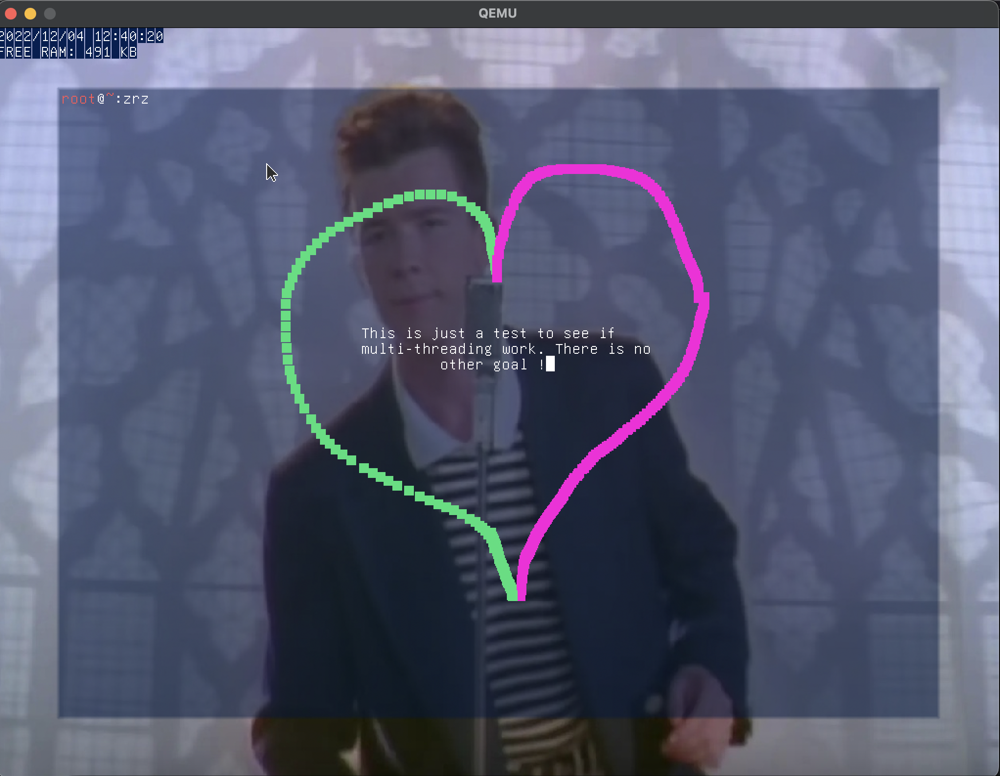

# Turb-OS
This project was done to be a school projet, it's NOT an example... About why and how, everything is explained bellow. 
There is an `image.iso` which is the last working Turb-OS' ISO. 
You can try to compile it by yourself, but Turb-OS is based on an old version of `limine`. 

## What's the goal ?

Have a "usable" OS that can be used on embedded systems. 
Meaning we want to implement:
- dynamic allocation
- scheduling / multitasking
- minimal display

## Tools used:
- clang
- lld
- LLVM
- Make
- nasm
- qemu
- xorriso
- wget
- tar

### Install tools
```
sudo apt-get install clang lld make nasm xorriso wget tar qemu-system-x86
```

if you're on windows, you need to compile with a WSL and run it with qemu ON WINDOWS

After cloning the repo, you can compile and run the OS by using:
```
make all
```
or to go faster and use multiple cores
```
make -j$(nproc --all)
```


# TODO LIST

- [x] minimal display
- [x] dynamic allocation
- [x] interruptions
- [x] keyboard input (PS/2)
- [x] mouse input (PS/2)
- [x] SMP
- [x] UBSAN
- [x] serial debugging
- [x] kernel panic
- [x] HPET (not tested)
- [x] scheduler
- [x] VFS

## Quick preview
### Starting and Commands

### Filesystem

### Drawing with the mouse

### Multitasking

